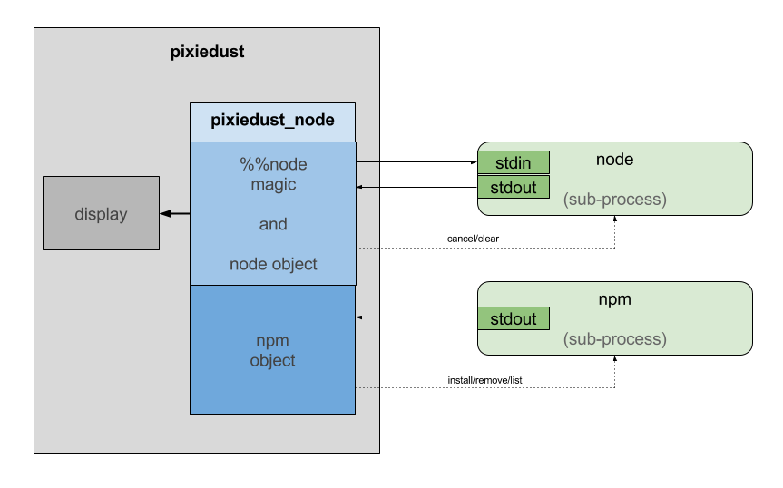

# pixiedust_node

PixieDust extension that enable a Jupyter Notebook user to invoke Node.js commands.




## How it works

The `pixiedust_node` Python module has access to Pixiedust's *display* API to render charts and maps. When `pixiedust_node` is imported into a notebook, a Node.js sub-process is setup and the notebook is configured so that cells beginning with '%%node' may contain JavaScript code: that code is piped to the Node.js sub-process automatically. The output of the Node.js process is parsed by `pixiedust_node` to handle the use of functions display/print/store/html/image. The `pixiedust_node` module also allows npm installs to be initiated from within the notebook. This achieved with further npm sub-processes whose output appears in the notebook. 

## Prerequisites

To use `pixiedust_node` you need to be running a Jupyter notebooks with the [Pixedust](https://github.com/ibm-cds-labs/pixiedust) extension installed. Notebooks can be run locally by [installing Pixiedust and its prerequisites](https://ibm-watson-data-lab.github.io/pixiedust/install.html).


You also need Node.js/npm installed. See the [Node.js downloads](https://nodejs.org/en/download/) page to find an installer for your platform.

## Installation

Inside your Jupyter notebook, install *pixiedust_node*  with

```python
!pip install pixiedust_node
```

## Running

Once installed, a notebook can start up *pixiedust_node* with:

```python
import pixiedust_node
```

## Using %%node

Use the `%%node` prefix in a notebook cell to indicate that the content that follows is JavaScript.

```js
%%node
print(new Date());
```

## Installing npm modules

You can install any [npm](https://www.npmjs.com/) module to use in your Node.js code from your notebook. To install npm modules, in a Python cell:

```python
npm.install('silverlining')
```

or install multiple libraries in one go:

```python
npm.install( ('request', 'request-promise') )
```

and then "require" the modules in your Node.js code.

```js
%%node
var silverlining = require('silverlining');
var request = require('request-promise');
```

You may also do :

- `npm.uninstall('packagename')` - to remove an npm module (or `npm.remove('packagename')`)
- `npm.list()` - to list the installed modules

## Node.js helper functions

Node.js functions are available to interact with the Notebook

- `print(x)` - print out the value of variable x 
- `display(x)` - use Pixiedust's `display` function to visualise an array of data
- `store(x,'y')` - turn a JavaScript array x into a Pandas data frame and store in Python variable y
- `html(x)` - render HTML string x in a notebook cell
- `image(x)` - render image URL x in a notebook cell
- `help()` - show help

### print

```js
%%node
// connect to Cloudant using Silverlining
var url = 'https://reader.cloudant.com/cities';
var cities = silverlining(url);

// fetch number of cities per country
cities.count('country').then(print);
```

### display

```js
%%node

// fetch cities called York
cities.query({name: 'York'}).then(display);
```

### store

** This function is deprecated as Node.js global variables are copied to the Python environment automatically **

```js
%%node

// fetch the data and store in Pandas dataframe called 'x'
cities.all({limit: 2500}).then(function(data) {
  store(data, 'x');
});
```

The dataframe 'x' is now available to use in a Python cell:

```python
x['population'].sum()
```

### html

```js
%%node
var str = 'Sales are up <b>25%</b>';
html(str);
```

### image

```js
%%node
var url = 'http://myserver.com/path/to/image.jpg';
image(url);
```

### help

```js
%%node
help();
```

## Node.js-Python bridge

Any *global* variables that you create in your `%%node` cells will be automatically copied to equivalent variables in Python. e.g if you create some variables in a Node.js cell:

```
%%node
var str = "hello world";
var n1 = 4.1515;
var n2 = 42;
var tf = true;
var obj = { name:"Frank", age: 42 };
var array_of_strings = ["hello", "world"];
var array_of_objects = [{a:1,b:2}, {a:3, b:4}];
```

Then these variables can be used in Python:

```
# Python cell
print str, n1, n2, tf
print obj
print array_of_strings
print array_of_objects
```

Strings, numbers, booleans and arrays of such are converted to their equivalent in Python. Objects are converted into Python dictionaries and arrays of objects are automatically converted into a Pandas DataFrames.

Note that only variables declared with `var` are moved to Python, not constants declared with `const`.


If you want to move data from an asynchronous Node.js callback, remember to write it to a *global variable*:

```js
%%node
var googlehomepage = '';
request.get('http://www.google.com').then(function(data) {
  googlehomepage = data;
  print('Fetched Google homepage');
});
```

Similarly, Python variables of type `str`, `int`, `float`, `bool`, `unicode`, `dict` or `list` will be moved to Node.js when a cell is executed:

```
# Python cell
a = 'hello'
b = 2
b = 3
c= False
d = {}
d["x"] = 1
d["y"] = 2
e = 3.142
```

The variables can then be used in Node.js:

```
%%node
console.log(a,b,c,d,e);
// hello 3 false { y: 2, x: 1 } 3.142
```

## Managing the Node.js process

If enter some invalid syntax into a `%%node` cell, such as code with more opening brackets than closing brackes, then the Node.js interpreter may not think you have finished typing and you receive no output.

You can cancel execution by running the following command in a Python cell:

```python
node.cancel()
```

If you need to clear your Node.js variables and restart from the beginning then issue the following command in an Python cell:

```python
node.clear()
```

## Help

You can view the help in a Python cell:

```python
node.help()
```
